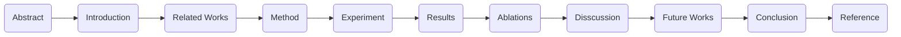
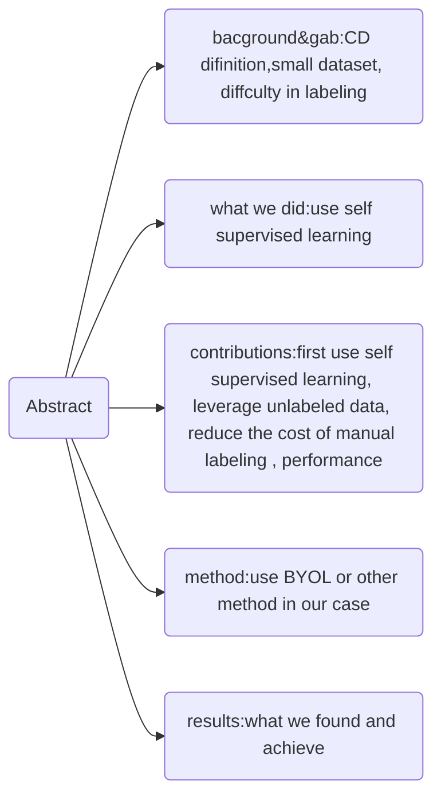
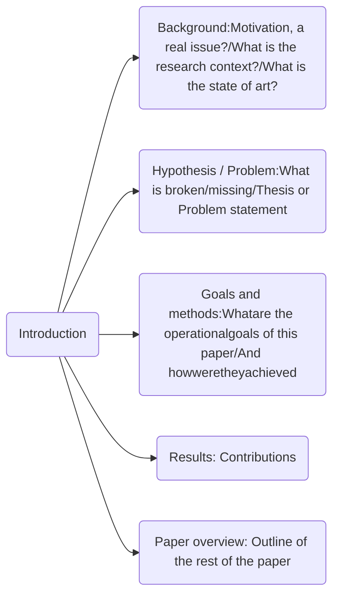
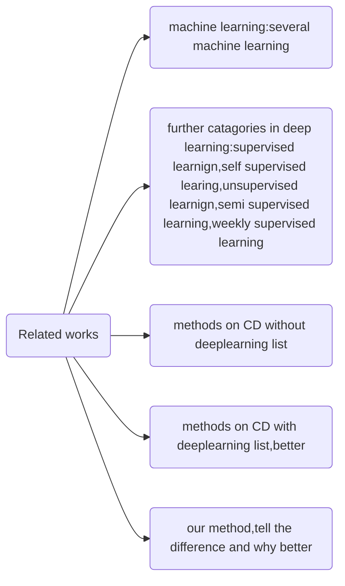
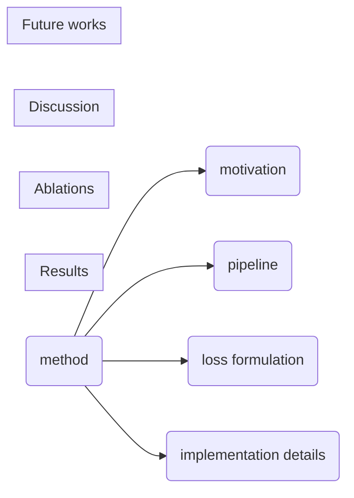

# Self-supervised-learning-for-Crohn-Disease-Detection
## framework for the report
#### overall

```mermaid
  graph  LR
      abs(Abstract)-->int(Introduction)
      int-->rel(Related Works)
      rel-->met(Method)
      met-->exp(Experiment)
      exp-->res(Results)
      res-->abl(Ablations)
      abl-->dis(Disscussion)
      dis-->fut(Future Works)
      fut-->con(Conclusion)
      con-->ref(Reference)
     
```
#### details in each part

```mermaid
  graph  LR
      abst(Abstract)-->1.1(bacground&gab:CD difinition,small dataset, diffculty in labeling)
      abst-->1.2(what we did:use self supervised learning)
      abst-->1.3(contributions:first use self supervised learning, leverage unlabeled data, reduce the cost of manual labeling , performance)
      abst-->1.4(method:use BYOL or other method in our case)
      abst-->1.5(results:what we found and achieve)
``` 

```mermaid
  graph  LR
    intr(Introduction)-->2.1(Background:Motivation, a real issue?/What is the research context?/What is the state of art?)
    intr-->2.2(Hypothesis / Problem:What is broken/missing/Thesis or Problem statement)
    intr-->2.3(Goals and methods:Whatare the operationalgoals of this paper/And howweretheyachieved)
    intr-->2.4(Results: Contributions )
    intr-->2.5(Paper overview: Outline of the rest of the paper)
```

```mermaid
  graph  LR
    rela(Related works)-->3.1(machine learning:several machine learning)
    rela-->3.2(further catagories in deep learning:supervised learnign,self supervised learing,unsupervised learnign,semi supervised learning,weekly supervised learning)
    rela-->3.3(methods on CD without deeplearning list)
    rela-->3.4(methods on CD with deeplearning list,better)
    rela-->3.5(our method,tell the difference and why better)
```

```mermaid
  graph  LR
    meth(method)-->4.1(motivation )
    meth-->4.2(pipeline)
    meth-->4.3(loss formulation)
    meth-->4.4(implementation details)

    subgraph Results
  end 
    subgraph Ablations
    end
    subgraph Discussion
    end
    subgraph Future works
    end
```
